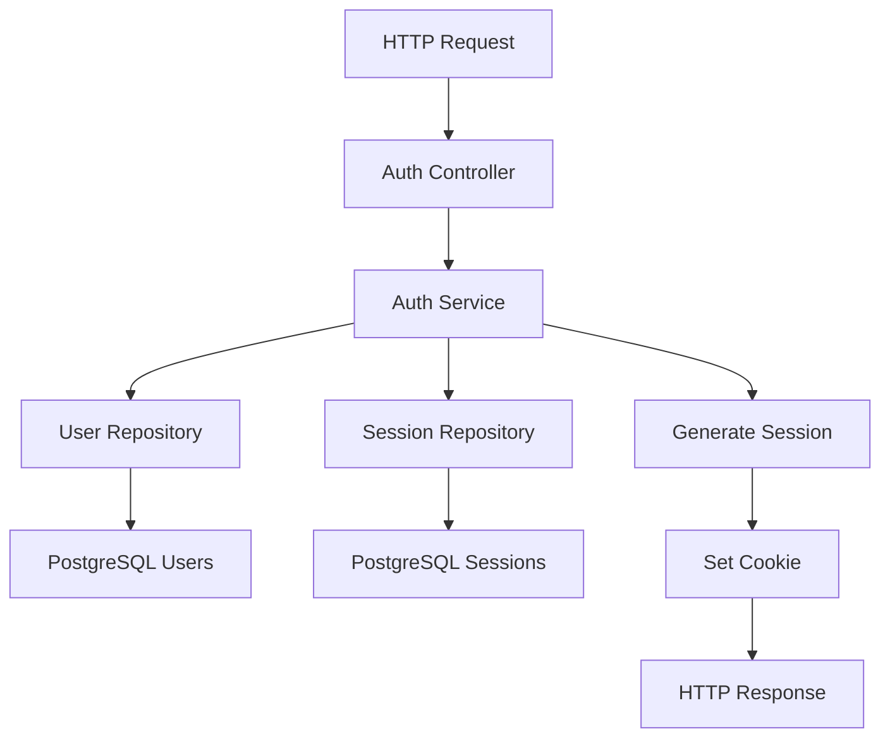

# Authentication Module Architecture

## Project Overview
Go-based authentication module with Gin framework and PostgreSQL, following clean architecture principles.

## Tech Stack
- **Language**: Go 1.21+
- **Framework**: Gin for HTTP routing
- **Database**: PostgreSQL with pgx driver
- **Password Hashing**: bcrypt
- **Session Storage**: PostgreSQL (sessions table)
- **Testing**: Go testing package, httptest

## Architecture Layers

### 1. Domain Layer
```
internal/domain/
├── user.go          # User entity
├── session.go       # Session entity  
└── repository.go    # Interfaces
```

### 2. Repository Layer
```
internal/repository/
├── user_repository.go
├── session_repository.go
└── postgres/        # PostgreSQL implementations
```

### 3. Service Layer
```
internal/service/
├── auth_service.go
└── session_service.go
```

### 4. Controller Layer
```
internal/controller/
├── auth_controller.go
└── middleware/
    └── auth_middleware.go
```

### 5. Infrastructure Layer
```
internal/infrastructure/
├── database/
├── config/
└── http/
```

## Database Schema

### Users Table
```sql
CREATE TABLE users (
    id UUID PRIMARY KEY DEFAULT gen_random_uuid(),
    email VARCHAR(255) UNIQUE NOT NULL,
    password_hash VARCHAR(255) NOT NULL,
    created_at TIMESTAMP DEFAULT CURRENT_TIMESTAMP,
    updated_at TIMESTAMP DEFAULT CURRENT_TIMESTAMP
);
```

### Sessions Table
```sql
CREATE TABLE sessions (
    session_id UUID PRIMARY KEY DEFAULT gen_random_uuid(),
    user_id UUID REFERENCES users(id) ON DELETE CASCADE,
    expires_at TIMESTAMP NOT NULL,
    created_at TIMESTAMP DEFAULT CURRENT_TIMESTAMP
);
```

## API Endpoints

### Public Routes
- `POST /api/v1/auth/register` - User registration
- `POST /api/v1/auth/login` - User login
- `POST /api/v1/auth/logout` - User logout

### Protected Routes (require auth middleware)
- `GET /api/v1/auth/me` - Get current user
- `POST /api/v1/auth/refresh` - Refresh session

## Flow Diagram



## Key Components

### 1. Password Security
- bcrypt with cost factor 12
- Salt generated automatically
- No plaintext password storage

### 2. Session Management
- UUID-based session IDs
- HttpOnly, Secure cookies
- Configurable expiration (default: 7 days)
- Automatic cleanup of expired sessions

### 3. Error Handling
- Consistent error response format
- HTTP status codes aligned with REST
- No sensitive information leakage

### 4. Validation
- Email format validation
- Password strength requirements
- Input sanitization

## Configuration
Environment variables for:
- Database connection string
- Server port
- Session expiration
- Bcrypt cost factor
- Cookie settings

## Testing Strategy
- Unit tests for services and repositories
- Integration tests with test database
- HTTP tests for API endpoints
- Mock implementations for isolation

## Dependencies
```go
github.com/gin-gonic/gin
github.com/jackc/pgx/v5
golang.org/x/crypto/bcrypt
github.com/google/uuid
```

## Project Structure
```
project/
├── cmd/
│   └── server/
│       └── main.go
├── internal/
│   ├── domain/
│   ├── repository/
│   ├── service/
│   ├── controller/
│   └── infrastructure/
├── migrations/
├── configs/
├── tests/
└── go.mod
```

## Next Steps
1. Initialize Go module
2. Set up database connection
3. Implement domain models
4. Create repository implementations
5. Build service layer
6. Add HTTP controllers
7. Implement middleware
8. Write comprehensive tests
9. Create documentation